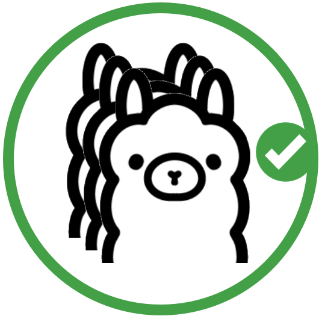

# JavaScript SDK for OllamaFlow

A JavaScript/TypeScript SDK for interacting with OllamaFlow server instances – providing Ollama and OpenAI compatible API wrappers plus Frontend/Backend management.

> This package is part of the [OllamaFlow monorepo](../../README.md).

## Features

- **Ollama API Compatibility** – Generate, Chat, Embeddings, Model management
- **OpenAI API Compatibility** – Completions, Chat Completions, Embeddings
- **Admin APIs** – Manage Frontends and Backends (create/update/retrieve/delete, health)
- **TypeScript Support** – Full TypeScript type definitions included

## Requirements

- Node.js v18.20.4
- npm

### Dependencies

- `jest` - for testing
- `msw` - for mocking the api
- `superagent` - for making the api calls

### Pre-commit Hooks

The pre-commit hooks will run automatically on `git commit`. They help maintain:

- Code formatting (using ruff)
- Import sorting
- Code quality checks
- And other project-specific checks

### Running Tests

The project uses `jest` for running tests in isolated environments. Make sure you have jest installed, which should automatically be there if you have installed dependencies via `npm i` command:

```bash
# Run only the tests
npm run test

# Run tests with coverage report
npm run test:coverage

```

## Contributing

We welcome contributions! Please see our [Contributing Guidelines](CONTRIBUTING.md) for details

## Feedback and Issues

Have feedback or found an issue? Please file an issue in our GitHub repository.

## Version History

Please refer to [CHANGELOG.md](CHANGELOG.md) for a detailed version history.
